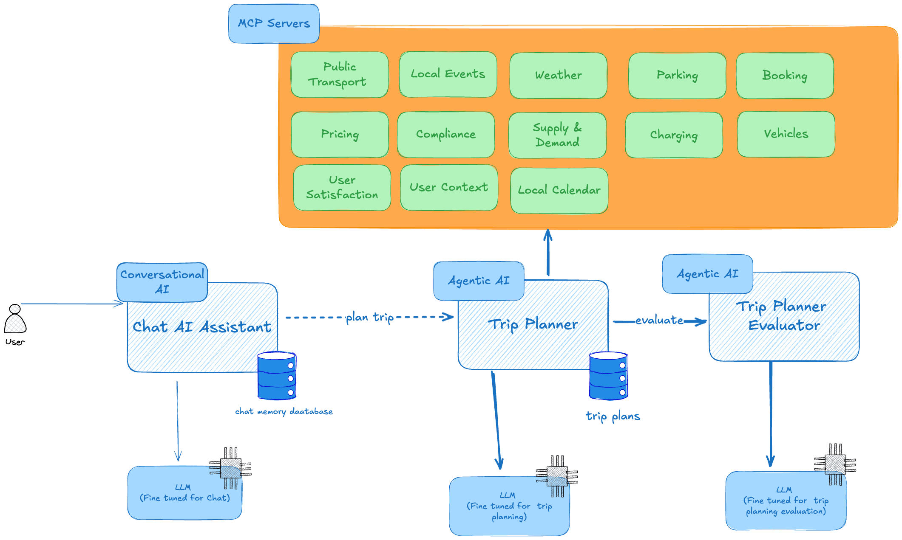
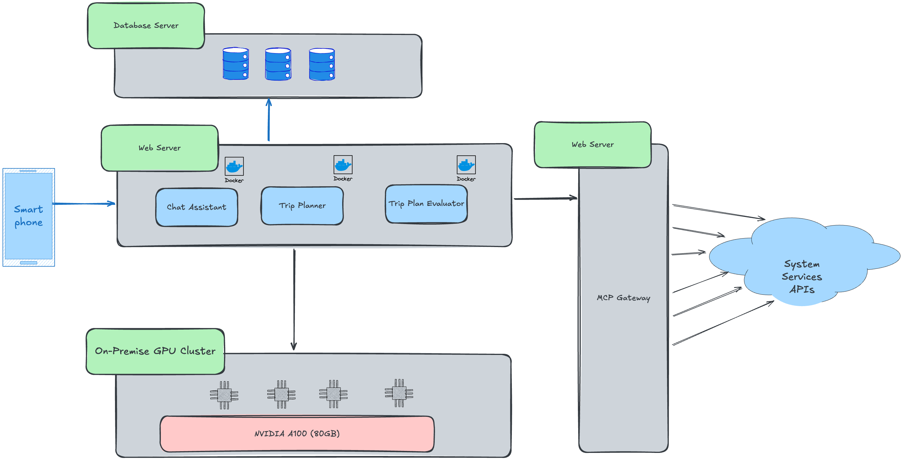

# FreshKata - Mobility Corp Architecture Kata

## Table of Contents
- [Glossary](#glossary)
- [Objectives](#objectives)
- [Team members](#team-members)
- [Context](#context)
    - [Booking Process](#booking-process)
    - [Vehicle Management](#vehicle-management)
    - [Return & Feedback](#return--feedback)
    - [Fleet Operations](#fleet-operations)
- [AI-Enabled Opportunities](#ai-enabled-opportunities)
- [Challenges](#challenges)
    - [1. Vehicle Availability & Demand Forecasting](#1-vehicle-availability--demand-forecasting)
    - [2. Battery & Charging Management](#2-battery--charging-management)
    - [3. Increasing Customer Engagement](#3-increasing-customer-engagement)
- [Key Objective](#key-objective)
- [Business Constraints](#business-constraints)
- [Solutions](#solutions)
    - [1: Scooter and Bike Rescheduling](#scooter-and-bike-rescheduling)
      - [The Problem](#the-problem)
      - [Business Decision](#business-decision)
      - [Machine Learning Models](#machine-learning-models)
        - [1. Demand Forecast Model](#1-demand-forecast-model)
        - [2. Supply-Shift Model](#2-supply-shift-model)
        - [3. Residual Network Optimizer](#3-residual-network-optimizer)
          - [Optimization](#optimization)
      - [Execution Loop](#execution-loop)
      - [Costs of the Approach](#costs-of-the-approach)
        - [Why this is a good choice](#why-this-is-a-good-choice)
      - [Conclusion](#conclusion)
    - [2: MobilityCorp — Agentic Trip Planner Architecture](#mobilitycorp--agentic-trip-planner-architecture)
        - [Goal](#goal)
        - [Why We Need an Agentic AI](why-we-need-an-agentic-ai)
            - [Problem Statement](#problem-statement)
            - [Why an Agentic AI](#why-an-agentic-ai)
        - [What the Agent Does](what-the-agent-does)
        - [MCP Servers](#mcp-servers)
        - [Data and Privacy](data-and-privacy)
        - [Evaluation Metrics](#evaluation-metrics)
        - [Generative AI Models (LLM) Deployment](generative-ai-models-llm-deployment)
            - [Deployment Strategy](#deployment-strategy)
            - [LLM Selection](#llm-selection)
            - [Hardware Requirements and Costs](#hardware-requirements-and-costs)
        - [Planning Evaluation Strategy](#planning-evaluation-strategy)
        - [AI Agent Trip Planning Evaluator](#ai-agent-trip-planning-evaluator)
        - [Diagrams](#diagrams)
            - [Component Based Thinking](#component-based-thinking)
            - [Deployment Architecture](#deployment-architecture)
- [Final Thoughts](#final-thoughts)


## Glossary

A glossary of key terms and concepts used throughout the MobilityCorp Architecture Kata can be found in [Glossary](GLOSSARY.md).

## Objectives

Come up with a new architecture for MobilityCorp, incorporating AI functionality where appropriate.

## Team members
* [Bahram Jahanshahi](https://www.linkedin.com/in/bahram-jahanshahi/)
* [Marlon Ehrich](https://www.linkedin.com/in/marlon-orlin-ehrich-0b5718247/)
* [Sebastian Krieger](https://www.linkedin.com/in/regeirknaitsabes/)
* [Camilo Gaviria](https://www.linkedin.com/in/juan-camilo-gaviria-holgu%C3%ADn-15a90461/)
* [Supreet Singh](https://www.linkedin.com/in/supreetsingh87/)

## Context

MobilityCorp operates a flexible, location-based rental service for electric scooters, eBikes, cars, and vans. The business model centers on convenient, app-driven bookings, real-time vehicle tracking, and efficient fleet management.
More details on the business model can be found in [MobilityCorp Business Model](business/business-model.md).

Vehicles are tracked, unlocked, and managed via a **mobile app** (with occasional web portal access). All vehicles are GPS-enabled, remotely controllable, and integrated into MobilityCorp’s operational system.

The company’s **business model** is based on:

* **Per-minute rental fees** (applied across all vehicle types)
* **Advance bookings** (Cars/Vans: up to 7 days; Bikes/Scooters: up to 30 minutes)
* **Late return and incorrect parking fines**
* **Incentives** (discounts or reward points) for returning vehicles to strategic parking spots.

The fleet is currently **fixed per country**, but the company has plans to scale up as demand grows. The primary short-term goal is to **maximize utilization of the existing vehicles** before expanding.

### Booking Process

- **Cars & Vans:**  
    - Bookable up to 7 days in advance  
    - Rentals are for a fixed duration
- **Bikes & Scooters:**  
    - Bookable up to 30 minutes in advance  
    - Open-ended rentals (up to 12 hours)

### Vehicle Management

- All vehicles are equipped with GPS trackers for real-time location monitoring.
- Remote unlocking via NFC-enabled smartphone app.
- Vehicles must be returned to designated parking spots.


### Return & Feedback

- Customers submit photos as proof of return.
- Cars and vans must be plugged into EV chargers at return.
- Feedback is collected, including vehicle faults and user experience.


### Fleet Operations

- Bikes and scooters require battery swaps, performed by staff at parking bays.
- Staff use real-time data to identify bays needing service and to redistribute vehicles to high-demand locations.


## AI-Enabled Opportunities

- **Demand forecasting & fleet distribution**: Predicts demand to optimize vehicle availability and placement.
- **Battery health & technician scheduling**: Monitors battery health and plans efficient technician routes.
- **Dynamic pricing & booking suggestions**: Adjusts pricing dynamically and suggests bookings based on demand.
- **Photo validation for vehicle return**: Automates vehicle return checks using AI vision models.
- **Personalization & mobility assistant**: Provides personalized travel recommendations and smart assistance.

Details on each opportunity can be found in [AI-Enabled Use Cases for MobilityCorp](business/ai-enabled-usecases.md).


## Challenges
Currently, the company faces the following main challenges:
### 1. Vehicle Availability & Demand Forecasting

Customers often complain that **vehicles aren’t available where and when they need them**.

Questions to solve:

  * Can we **anticipate customer demand** at specific times and locations?
  * Can we **reposition vehicles in advance**?
  * Can we **predict demand spikes** (e.g. post-work scooter rides)?

### 2. Battery & Charging Management
The company has problems with electric vehicels running out of charge.
Where scooters and bikes require **manual battery swaps**.

Questions to solve:

  * Can we work out how to prioritise which vehicles to switch out batteries? (for bikes and scooters)
  * Can we find optimal routes for battery swapping?

### 3. Increasing Customer Engagement
Many users treat rentals as **ad-hoc usage** rather than **regular commuting options**.

Questions to solve:

  * Can we encourage recurring bookings (e.g., daily work commutes)?
  * Can we **suggest bookings proactively** based on user history?
  * Can we incentivize loyalty through dynamic pricing, discounts, or rewards?


## Key Objective
How might we **adopt Generative AI and predictive ML** to:

* Improve fleet availability and reliability,
* Increase usage of available stock,
* Increase customer loyalty,


## Business Constraints
* **Mandatory Parking Spots**: All rentals end at designated bays; cars/vans must be plugged in.
* **Multi-language & GDPR Compliance**: All solutions must respect EU data laws and support multiple languages.

* **Cost-effectiveness** of deploying AI and predictive services without overburdening operating expenses.

## Solutions

In this section, we outline the proposed architecture and solutions to address the challenges faced by MobilityCorp.

We provided two AI-Enabled use cases as solutions to the challenges identified earlier.  

1. [Scooter and Bike Rescheduling](#scooter-and-bike-rescheduling)
2. [MobilityCorp — Agentic Trip Planner Architecture](#mobilitycorp--agentic-trip-planner-architecture)

## Scooter and Bike Rescheduling
This section describes an **ML-driven approach to optimally reroute and reschedule scooters and bikes** so that vehicles are available where and when customers need them. The solution combines **demand forecasting, supply flow prediction, and optimization models** to guide both nightly bulk rebalancing and continuous daytime adjustments.  

By doing so, it directly addresses [Challenge 1: Vehicle Availability & Demand Forecasting](#1-vehicle-availability--demand-forecasting), specifically answering all three of its key questions:  
- Can we **anticipate customer demand** at specific times and locations? ✅  
- Can we **reposition vehicles in advance**? ✅  
- Can we **predict demand spikes** (e.g., post-work scooter rides)? ✅  

It also supports the [Key Objective](#key-objective) to:  
- **Improve fleet availability and reliability**,  
- **Increase usage of available stock**, and  
- **Strengthen customer loyalty** by ensuring a dependable service for daily commutes and other recurring trips.  

### The Problem
Customers often complain that scooters and bikes are not available where they need them.  
This problem arises because demand is uneven in space and time, while customers naturally relocate vehicles in ways we cannot directly control.  
If we do not anticipate these dynamics, vehicles pile up in some areas while others run dry, leading to lost demand and poor customer satisfaction.

We devide this problem into three steps:

1. We first need to **know the demand** in every zone and every time slice → this is done with the **demand forecast**.  
2. We then need to **simulate how the supply will shift naturally** as customers move scooters and bikes around → this is done with the **supply flow network**.  
3. Finally, we must **see what is left over**, i.e. where deficits and surpluses remain after natural flows, and only there decide where trucks should intervene → this is the **residual network**.  

By separating **prediction** (what will happen naturally) from **optimization** (what we want to change), we can ensure that trucks are only used where they truly add value.

---

### Business Decision
We made a strategic decision to split rebalancing into **two phases**:

1. **Nightly Relocation (Reset)**  
   - During the night, demand is very low but supply is high.  
   - We use this opportunity to perform a **bulk relocation** so that by **06:00 every zone has its optimal starting stock**.  
   - This starting state must satisfy the **early morning demand forecast** and anticipate the **first natural supply shifts** caused by customers in the hours after 06:00.  
   - In other words: the nightly plan uses both the **demand forecast** and the **supply flow model** to create the most stable possible baseline.  
   - See [ADR-004-nightly-rebalance](ADRs/ADR-004-nightly-rebalance.md).

2. **Daytime Continuous Optimization**  
   - Once the day begins, bikes and scooters are constantly moving due to customer trips.  
   - We predict these **natural relocations** via the supply flow forecast and only use trucks where demand will not be satisfied otherwise.  
   - This ensures that trucks are used sparingly and effectively, reducing costs while keeping customers happy.  
   - Here we add the **residual network** to identify surpluses and deficits and compute specific **intraday truck routes** (via min-cost transshipment) so that we can actively rebalance the system during the day.  

---


### Machine Learning Models

To enable this strategy, we rely on **two predictive models** that describe how customers interact with the fleet, plus an **optimization model** that decides how trucks should intervene.

#### 1. Demand Forecast Model

The **demand forecast** tells us *what customers want* — the attempted bookings per zone in each time interval, regardless of whether we have supply available.

* **Inputs**:

  * Historical attempted bookings from the in-house booking system.
  * External data such as weather forecasts, holidays, and events.
* **Method**: ARIMAX baseline (time-series with exogenous factors).
* **Granularity**: Predicts demand per zone in **15-minute intervals**.
* **Output**: A **time series of demand forecasts** for each zone (e.g., “Zone A: 10 bookings expected between 08:00–08:15”).

This forecast provides the baseline demand curve we must satisfy in both the **nightly reset** and the **daytime optimization**.


See [ADR-010-demand-forecast-model](ADRs/ADR-010-demand-forecast-model.md).

---

#### 2. Supply-Shift Model

The **supply-shift model** tells us *how customers move vehicles* between zones, conditional on current availability.
For example: if Zone A has 20 scooters at 08:00, and history shows 30% usually flow to Zone B in that slot, we expect around 6 scooters to move. If Zone A has only 2 scooters, then only 2 can move, even if demand would be higher.

* **Inputs**:

  * **Current zone stock** (GPS data).
  * **Historical relocation patterns** (pickup/dropoff pairs).
* **Output**: Predicted **user-driven relocations** between zones and times, forming **natural flow arcs** in the supply flow network.

This model is essential because it prevents us from overestimating deficits or surpluses: it tells us which zones will naturally self-balance thanks to customers.

---

#### 3. Residual Network Optimizer
The **residual optimizer** is where we bring together the **demand forecast** and the **supply-shift model** to see the *real imbalances* that customers will experience if nothing is done.  

Think of it step by step:

1. **Demand forecast** tells us:  
   - For each zone and each 15-minute interval, how many attempted bookings we expect.  
   - Example: Zone A at 09:30–09:45 → predicted demand = 20 rides.  

2. **Current stock** tells us how many vehicles are available right now at each zone.  
   - Example: Zone A currently (08:30) has 10 scooters

3. **Supply-shift model** projects how this stock will redistribute in future intervals based on customer flows.  
   - Example: Of the 10 scooters in Zone A now, we expect 5 to be taken to other zones by 09:30.  
   - At the same time, we expect 8 scooters to flow into Zone A from other zones by 09:30.  

4. **Residual calculation**:  
   - Predicted available supply at Zone A for 09:30–09:45 =  
     current stock (10) – outflow (5) + inflow (8) = 13.  
   - Predicted demand = 20.  
   - **Residual deficit = 7**.  

This process runs continuously for all zones and all 15-minute intervals in the forecast horizon.  
The result is a **residual network** where each node (zone, time) is labeled as:  
- **Surplus**: predicted supply > predicted demand.  
- **Deficit**: predicted supply < predicted demand.  

Therefore the residual network shows us **only the gaps that matter** after accounting for customer behavior.  
- If demand and supply naturally balance (thanks to customer relocations), trucks do nothing.  
- If a deficit remains (like Zone A with -7 in the example), the residual network highlights it as a **target for rebalancing**.  

#### Optimization
Once surpluses and deficits are identified:  
- We connect surplus nodes to deficit nodes with possible truck moves (edges).  
- We then solve an optimization problem via **Min-cost transshipment** → find the cheapest way to cover deficits with surpluses
  
  See [ADR-012-min-cost-transshipment-solver](ADRs/ADR-012-min-cost-transshipment-solver.md).

**Output**: concrete truck relocation plans such as:  
- “Truck 1 picks up 10 scooters at Zone B at 08:45, drops 7 at Zone A by 09:15, swaps 5 batteries on the way.”  

This ensures trucks are only dispatched to fix **residual gaps** that natural flows cannot cover.


### Execution Loop
The system runs in a **rolling horizon** throughout the day:

- Every 10–15 minutes, we refresh forecasts, rebuild the supply flow network, compute residuals, and re-run optimization.  
- Trucks are dispatched with only the **next leg committed**, but drivers see a possible multistop tour in advance
- When a truck confirms a move:  
  - The source stock is reduced immediately.  
  - An “unnatural arc” is added to the supply flow network.  
  - Forecasts and residuals are recomputed, so the system always stays aligned with reality.  


### Costs of the Approach

Our chosen approach — combining a **demand forecast**, a **supply-shift forecast**, and a **residual optimization via min-cost transshipment** — is deliberately lightweight in terms of cost:

- **Computational cost**:  
  - Demand forecasting with ARIMAX and supply-shift predictions are simple, interpretable models that can run efficiently at scale.  
  - Min-cost transshipment is a polynomial-time optimization problem and can be solved quickly even for large networks, making it suitable for frequent re-runs.  

#### Why this is a good choice
- **Low infrastructure footprint**: no heavy deep learning pipelines are required at this stage.  
- **Fast to run and update**: models and optimization can be refreshed every 10–15 minutes.  
- **Explainable**: each decision (demand forecast → supply forecast → residual gap → truck move) is transparent and traceable.  
 

### Conclusion

With this setup we directly address the root cause of the problem: scooters and bikes being in the wrong places.  

- The **demand forecast** ensures we know where customers will want vehicles, in 15-minute resolution.  
- The **supply-shift model** shows how customers will naturally redistribute vehicles, so we don’t waste truck effort fixing what will fix itself.  
- The **residual optimizer** isolates only the true gaps and turns them into actionable truck routes, ensuring that deficits are covered in time.  
- The **rolling execution loop** keeps predictions and actions aligned with reality, as every confirmed truck move feeds back into the system.  

As a result:  
- Customers find vehicles when and where they need them.  
- The company reduces lost demand while minimizing costly truck relocations.  

For further details and rationale behind each decision, see the linked ADRs.  


## MobilityCorp — Agentic Trip Planner Architecture

### Goal

Design an **Agentic AI** that assists MobilityCorp users in planning their **daily, weekly, or monthly trips**.

#### Key Functions
- Plans travel based on:
    - User schedules
    - Available vehicles
    - Other relevant data sources
- Ensures the **right vehicle is available at the right place and time**
- Sends **demand signals** to suppliers when needed
- If no vehicle is available, it **requests the supply team** to rebalance vehicles proactively

---

### Why We Need an Agentic AI
Users need a smart, reliable way to plan trips with MobilityCorp vehicles — knowing:
* 
* When to leave to arrive on time
* Which vehicle to use (scooter, bike, car)
* Where to pick up and drop off
* Trip cost and what to do if issues arise (weather, traffic, low battery)

MobilityCorp needs to:

* Predict vehicle demand by location and time
* Rebalance supply before shortages
* Ensure legal compliance
* Optimize fleet use and cut operational costs

#### Why an Agentic AI
See ADR: [ADR-021: Why do we need Agentic AI?](ADRs/ADR-021-need-for-agentic-ai.md)
Planning trips is complex and depends on dynamic factors:
* User preferences vary (fastest, cheapest, greenest)
* Weather and traffic change often
* Rules differ by city and country
* Vehicle availability is inconsistent
* Supply teams need better demand forecasting
---

### What the Agent Does?

* Helps users plan daily or recurring trips (like home-to-work).
* Checks data from MCP servers: weather, local rules amd restrictions, traffic, public transport, fleet status, and user habits.
* Creates **main and backup travel plans**.
* Sends booking or supply requests when availability is low.
* Monitors ongoing trips and re-plans when needed.

**Example use cases:**

1. User says: “Plan my morning trip to work at 8:00.”
2. Agent collects data from MCP servers (weather, public transport, fleet, parking, and etc).
3. Agent builds a main plan and 2 backups.
4. Agent checks range, battery, parking, and restrictions.
5. Agent creates soft bookings and sends a demand signal if vehicles are low.
6. If something changes (e.g., rain or traffic), the agent re-plans automatically.

**Prompt Example:**

```
You are the MobilityCorp Trip Planning Agent.
Goal: Plan a user trip.
User wants to go from Home (lat: 59.334, lng: 18.071) to Office (lat: 59.347, lng: 18.055) by 8:30 AM.
Use the following MCP tools:
- Fleet & Booking MCP to find available vehicles.
- Weather MCP to check rain or strong wind.
- Transit MCP to get next train departures.
- Parking MCP to find valid return bays near destination.
- Supply MCP to send demand if no scooters are near origin.
Provide: Main and backup plans, each with ETA, cost, and risk score.
```

---

### MCP Servers

#### Why MCP Servers?
MCP Servers offer structured APIs that provide real-time data and enable actions within MobilityCorp’s ecosystem.  
Instead of building new systems, the Agentic AI leverages these APIs to gather information and perform tasks efficiently.  
Their modular design allows seamless integration, ensuring scalability, flexibility, and easy maintenance.

#### Useful MCP Servers for Trip Planning
MCP Servers provide essential data and functionality for trip planning, covering all aspects of MobilityCorp’s ecosystem. 
They manage vehicle booking, telemetry, parking, charging, and supply operations while integrating real-time 
inputs like weather, traffic, public transport, and local events. Additional services handle pricing, compliance, payments, 
and user context, ensuring the Agentic AI can plan, monitor, and optimize trips efficiently.

---

### Data and Privacy
* Vehicle and user data are stored securely in the EU (GDPR compliant).
* Data access follows user consent scopes.
* All tool calls are logged for audit and traceability.
---

### Evaluation Metrics
* **User Satisfaction:** Measure via post-trip surveys (target >85% satisfaction).
* **On-Time Arrival Rate:** Percentage of trips arriving on time (target >90%).
* **Demand Forecast Accuracy:** Mean Absolute Percentage Error (MAPE) of demand predictions (target <10%).
* **Rebalance Efficiency:** Reduction in supply requests due to proactive rebalancing (target >15% reduction).
* **Compliance Rate:** Percentage of trips adhering to local regulations (target 100%).
* **System Uptime:** Availability of the Agentic Trip Planner service (target >99.9%).

### Generative AI Models (LLM) Deployment

#### Deployment Strategy
see ADR: [ADR-022: AI Model Deployment Strategy](ADRs/ADR-022-Gen_AI_Model_Deployment_Strategy.md)

* As this AI Agent does not need a big LLM and mainly focuses on planning and decision-making, a **Centralized Model Hosting** approach is recommended to ensure data security and ease of management.
* Self-hosting the AI models on MobilityCorp servers will provide better control over user data and compliance with privacy regulations.
* As the number of requests for planning is predictable and limited, the latency introduced by centralized hosting is manageable.

#### LLM Selection
see ADR: [ADR-023: LLM Selection for Agentic AI](ADRs/ADR-023-LLM_Selection_for_Agentic_AI.md)

Llama 3 (70B) was chosen for its strong reasoning, structured tool-calling, and compatibility with MCP and RAG systems.  
It outperformed other open-source models in multi-step planning, scalability, and licensing suitability, making it ideal for building an autonomous, intelligent trip-planning agent.


#### Hardware Requirements and Costs
See ADR: [ADR-024: Selection of On-Premise GPU Cluster for Agentic AI Trip Planning System](ADRs/ADR-024-Selection-of-On-Premise-GPU-Cluster-for-Agentic-AI-Trip-PlanningSystem.md)

##### Hardware and Cost Breakdown (Estimated, 2025)
| Component | Quantity | Description | Est. Unit Cost (USD) | Total Cost (USD) |
|------------|-----------|--------------|----------------------|------------------|
| **NVIDIA A100 (80GB)** | 4 | Core inference GPUs for Llama 3 (70B) | $20,000 | $80,000          |
| **RTX 6000 Ada (48GB)** | 2 | Development and testing GPUs | $12,500 | $25,000          |
| **Compute Nodes (Dual Xeon, 512GB RAM)** | 2 | High-performance servers | $10,000 | $20,000          |
| **NVMe Storage (20TB RAID)** | 1 | Model weights, embeddings, and cache | $8,000 | $8,000           |
| **Networking, Cooling, and Power Systems** | – | Cluster infrastructure and redundancy | – | $12,000          |
| **Total Estimated Cost (One-time Investment)** | – |  |  | $145,000   |


### Planning Evaluation Strategy
To evaluate the effectiveness of the trip planning agent, the following strategy will be implemented:
1. **A/B Testing:** Conduct A/B tests comparing the agent's trip plans with traditional planning methods to assess user satisfaction and trip efficiency.
2. **User Feedback Collection:** Implement feedback mechanisms within the app to gather user opinions on trip plans, ease of use, and overall experience.
3. **Performance Monitoring:** Continuously monitor key performance indicators (KPIs) such as on-time arrival rates, demand forecast accuracy, and compliance rates.
4. **Iterative Improvements:** Use collected data to refine the planning algorithms, improve AI decision-making, and enhance user experience over time.
5. **Regular Audits:** Conduct regular audits of the agent's decisions to ensure compliance with local regulations and company policies.

### AI Agent Trip Planning Evaluator
It's needed to have a dedicated AI Agent Trip Planning Evaluator that assesses the quality of trip plans generated by the Agentic Trip Planner. This evaluator will:
* Analyze trip plans based on criteria such as efficiency, cost-effectiveness, user preferences, and compliance.
* Provide feedback to the planning agent for continuous improvement.
* Generate reports on trip planning performance for stakeholders.
* Utilize historical trip data to benchmark and validate the effectiveness of new trip plans.
* Incorporate user feedback to refine evaluation metrics and ensure alignment with user expectations.

### Diagrams

#### Component Based Thinking



#### Deployment Architecture

There are 6 main components in the deployment architecture:
1. **User Devices:** Smartphones or web apps where users interact with the trip planning agent.
2. **MCP Gateway Servers:** MCP Gateway expose all System Services API as MCP Servers for the Agentic AI to consume.
3. **Web Server for Agentic AI:** Hosts Chat Assistant, Agentic Trip Planner, and Trip Planning Evaluator.
4. **On-Premise GPU Cluster:** Dedicated hardware for hosting LLMs and performing inference tasks.
5. **Database Servers:** Store user data, trip plans, and logs securely.
6. **System Services API:** Internal APIs (Booking, Supply, etc) and Third-party APIs for weather, traffic, public transport, etc.



# Final Thoughts

The proposed architecture for MobilityCorp illustrates how AI and data-driven systems can revolutionize shared mobility. 
Through two core solutions — **Scooter and Bike Rescheduling** and the **Agentic Trip Planner** — the design addresses critical challenges 
such as vehicle availability, demand forecasting, and user engagement. 
The rescheduling system ensures optimal fleet distribution using predictive and optimization models, 
while the Agentic AI enables personalized, dynamic trip planning powered by real-time data from MCP servers and an advanced LLM.

Together, these solutions showcase a scalable and intelligent ecosystem where predictive analytics, automation, 
and agentic reasoning converge to improve efficiency, reliability, and user satisfaction. 
By building on open technologies and modular APIs, MobilityCorp is well-positioned to evolve toward 
a fully autonomous mobility network — one that anticipates demand, minimizes operational costs, 
and enhances every user’s travel experience.


