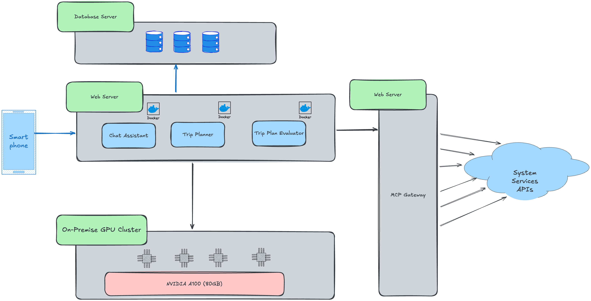

# MobilityCorp — Agentic Trip Planner Architecture


## Goal

Design an **Agentic AI** that assists MobilityCorp users in planning their **daily, weekly, or monthly trips**.


### Key Functions

- Plans travel based on:
    - User schedules
    - Available vehicles
    - Other relevant data sources
- Ensures the **right vehicle is available at the right place and time**
- Sends **demand signals** to suppliers when needed
- If no vehicle is available, it **requests the supply team** to rebalance vehicles proactively


## Why We Need an Agentic AI

Users need a smart, reliable way to plan trips with MobilityCorp vehicles — knowing: 
* When to leave to arrive on time
* Which vehicle to use (scooter, bike, car)
* Where to pick up and drop off
* Trip cost and what to do if issues arise (weather, traffic, low battery)

MobilityCorp needs to:
* Predict vehicle demand by location and time
* Rebalance supply before shortages
* Ensure legal compliance
* Optimize fleet use and cut operational costs


See ADR: [ADR-021: Why do we need Agentic AI?](../ADRs/ADR-021-need-for-agentic-ai.md)

Planning trips is complex and depends on dynamic factors:
* User preferences vary (fastest, cheapest, greenest)
* Weather and traffic change often
* Rules differ by city and country
* Vehicle availability is inconsistent
* Supply teams need better demand forecasting


## What the Agent Does?

* Helps users plan daily or recurring trips (like home-to-work).
* Checks data from MCP servers: weather, local rules amd restrictions, traffic, public transport, fleet status, and user habits.
* Creates **main and backup travel plans**.
* Sends booking or supply requests when availability is low.
* Monitors ongoing trips and re-plans when needed.

**Example use cases:**
1. User says: “Plan my morning trip to work at 8:00.”
2. Agent collects data from MCP servers (weather, public transport, fleet, parking, and etc).
3. Agent builds a main plan and 2 backups.
4. Agent checks range, battery, parking, and restrictions.
5. Agent creates soft bookings and sends a demand signal if vehicles are low.
6. If something changes (e.g., rain or traffic), the agent re-plans automatically.

**Prompt Example:**
```
You are the MobilityCorp Trip Planning Agent.
Goal: Plan a user trip.
User wants to go from Home (lat: 59.334, lng: 18.071) to Office (lat: 59.347, lng: 18.055) by 8:30 AM.
Use the following MCP tools:
- Fleet & Booking MCP to find available vehicles.
- Weather MCP to check rain or strong wind.
- Transit MCP to get next train departures.
- Parking MCP to find valid return bays near destination.
- Supply MCP to send demand if no scooters are near origin.
Provide: Main and backup plans, each with ETA, cost, and risk score.
```


## MCP Servers


### Why MCP Servers?

MCP Servers offer structured APIs that provide real-time data and enable actions within MobilityCorp’s ecosystem.  
Instead of building new systems, the Agentic AI leverages these APIs to gather information and perform tasks efficiently.  
Their modular design allows seamless integration, ensuring scalability, flexibility, and easy maintenance.


### Useful MCP Servers for Trip Planning

MCP Servers provide essential data and functionality for trip planning, covering all aspects of MobilityCorp’s ecosystem. 
They manage vehicle booking, telemetry, parking, charging, and supply operations while integrating real-time 
inputs like weather, traffic, public transport, and local events. Additional services handle pricing, compliance, payments, 
and user context, ensuring the Agentic AI can plan, monitor, and optimize trips efficiently.


## Data and Privacy

* Vehicle and user data are stored securely in the EU (GDPR compliant).
* Data access follows user consent scopes.
* All tool calls are logged for audit and traceability.


## Evaluation Metrics

* **User Satisfaction:** Measure via post-trip surveys (target >85% satisfaction).
* **On-Time Arrival Rate:** Percentage of trips arriving on time (target >90%).
* **Demand Forecast Accuracy:** Mean Absolute Percentage Error (MAPE) of demand predictions (target <10%).
* **Rebalance Efficiency:** Reduction in supply requests due to proactive rebalancing (target >15% reduction).
* **Compliance Rate:** Percentage of trips adhering to local regulations (target 100%).
* **System Uptime:** Availability of the Agentic Trip Planner service (target >99.9%).


## Generative AI Models (LLM) Deployment


### Deployment Strategy

see ADR: [ADR-022: AI Model Deployment Strategy](../ADRs/ADR-022-Gen_AI_Model_Deployment_Strategy.md)

* As this AI Agent does not need a big LLM and mainly focuses on planning and decision-making, a **Centralized Model Hosting** approach is recommended to ensure data security and ease of management.
* Self-hosting the AI models on MobilityCorp servers will provide better control over user data and compliance with privacy regulations.
* As the number of requests for planning is predictable and limited, the latency introduced by centralized hosting is manageable.


### LLM Selection

see ADR: [ADR-023: LLM Selection for Agentic AI](../ADRs/ADR-023-LLM_Selection_for_Agentic_AI.md)

Llama 3 (70B) was chosen for its strong reasoning, structured tool-calling, and compatibility with MCP and RAG systems.  
It outperformed other open-source models in multi-step planning, scalability, and licensing suitability, making it ideal for building an autonomous, intelligent trip-planning agent.


### Hardware Requirements and Costs

See ADR: [ADR-024: Selection of On-Premise GPU Cluster for Agentic AI Trip Planning System](../ADRs/ADR-024-Selection-of-On-Premise-GPU-Cluster-for-Agentic-AI-Trip-PlanningSystem.md)


#### Hardware and Cost Breakdown (Estimated, 2025)

| Component | Quantity | Description | Est. Unit Cost (USD) | Total Cost (USD) |
|------------|-----------|--------------|----------------------|------------------|
| **NVIDIA A100 (80GB)** | 4 | Core inference GPUs for Llama 3 (70B) | $20,000 | $80,000          |
| **RTX 6000 Ada (48GB)** | 2 | Development and testing GPUs | $12,500 | $25,000          |
| **Compute Nodes (Dual Xeon, 512GB RAM)** | 2 | High-performance servers | $10,000 | $20,000          |
| **NVMe Storage (20TB RAID)** | 1 | Model weights, embeddings, and cache | $8,000 | $8,000           |
| **Networking, Cooling, and Power Systems** | – | Cluster infrastructure and redundancy | – | $12,000          |
| **Total Estimated Cost (One-time Investment)** | – |  |  | $145,000   |


## Planning Evaluation Strategy

To evaluate the effectiveness of the trip planning agent, the following strategy will be implemented:
1. **A/B Testing:** Conduct A/B tests comparing the agent's trip plans with traditional planning methods to assess user satisfaction and trip efficiency.
2. **User Feedback Collection:** Implement feedback mechanisms within the app to gather user opinions on trip plans, ease of use, and overall experience.
3. **Performance Monitoring:** Continuously monitor key performance indicators (KPIs) such as on-time arrival rates, demand forecast accuracy, and compliance rates.
4. **Iterative Improvements:** Use collected data to refine the planning algorithms, improve AI decision-making, and enhance user experience over time.
5. **Regular Audits:** Conduct regular audits of the agent's decisions to ensure compliance with local regulations and company policies.

## AI Agent Trip Planning Evaluator

It's needed to have a dedicated AI Agent Trip Planning Evaluator that assesses the quality of trip plans generated by the Agentic Trip Planner. This evaluator will:
* Analyze trip plans based on criteria such as efficiency, cost-effectiveness, user preferences, and compliance.
* Provide feedback to the planning agent for continuous improvement.
* Generate reports on trip planning performance for stakeholders.
* Utilize historical trip data to benchmark and validate the effectiveness of new trip plans.
* Incorporate user feedback to refine evaluation metrics and ensure alignment with user expectations.

## Diagrams

### Component Based Thinking


### Deployment Architecture

There are 6 main components in the deployment architecture:
1. **User Devices:** Smartphones or web apps where users interact with the trip planning agent.
2. **MCP Gateway Servers:** MCP Gateway expose all System Services API as MCP Servers for the Agentic AI to consume.
3. **Web Server for Agentic AI:** Hosts Chat Assistant, Agentic Trip Planner, and Trip Planning Evaluator.
4. **On-Premise GPU Cluster:** Dedicated hardware for hosting LLMs and performing inference tasks.
5. **Database Servers:** Store user data, trip plans, and logs securely.
6. **System Services API:** Internal APIs (Booking, Supply, etc) and Third-party APIs for weather, traffic, public transport, etc.

