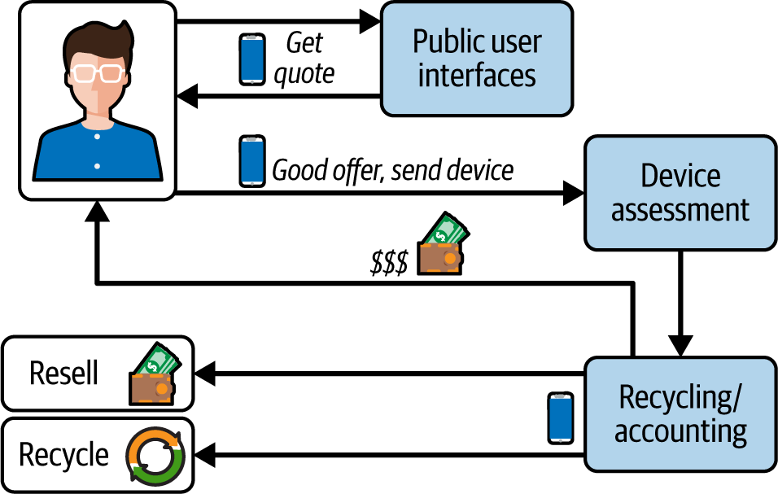
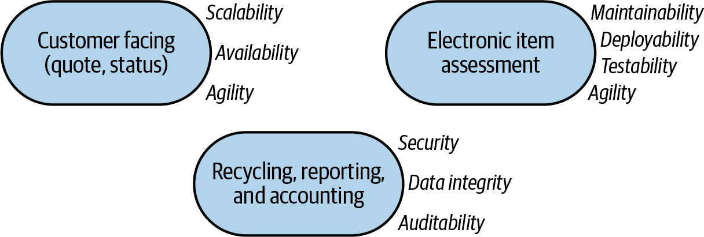
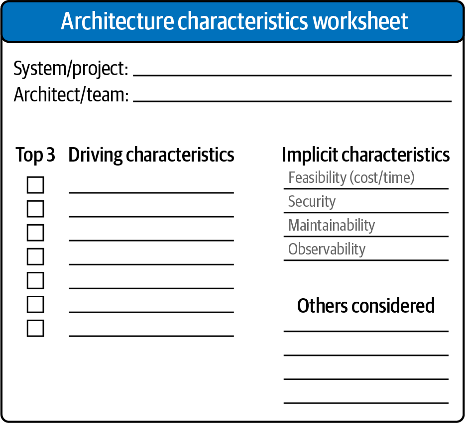
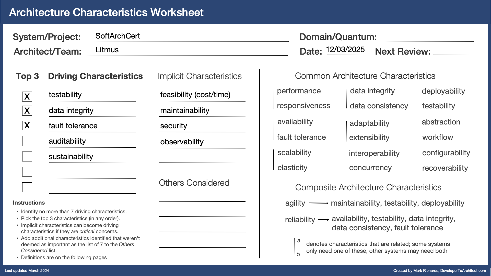

# Architecture Characteristics

## Introduction
When designing a software architecture, several key characteristics should be considered to ensure the system meets its requirements and performs effectively. Here are some of the most important architecture characteristics:
- An architecture characteristic specifies a nondomain design consideration.
- An architecture characteristic influences some structural aspect of the design
- An architecture characteristic must be critical or important to application success.

### Operational Architecture Characteristics
Operational architectural characteristics cover capabilities such as performance, scalability, elasticity, availability, and reliability.
#### Availability
How much of the time the system will need to be available; if that’s 24/7, steps need to be in place to allow the system to be up and running quickly in case of any failure.
#### Continuity
The system’s disaster recovery capability.
#### Performance
How well the system performs; ways to measure this include stress testing, peak analysis, analysis of the frequency of functions used, and response times.
#### Recoverability
Business continuity requirements: in case of a disaster, how quickly the system must get back online. This includes backup strategies and requirements for duplicate hardware.
#### Reliability/safety
Whether the system needs to be fail-safe, or if it is mission critical in a way that affects lives. If it fails, will it cost the company large sums of money? This is often a spectrum rather than a binary.
#### Robustness
The system’s ability to handle error and boundary conditions while running, for example, if the internet connection or power fails.
### Scalability
The system’s ability to perform and operate as the number of users or requests increases.

### Structural Architecture Characteristics
Architects are responsible for proper code structure. In many cases, the architect has sole or shared responsibility for the code’s quality, including its modularity, its readability, how well coupling between components is controlled, readable code, and a host of other internal quality assessments.
#### Configurability
How easily end users can change aspects of the software’s configuration through interfaces.
#### Extensibility
How well the architecture accommodates changes that extend its existing functionality.
#### Installability
How easy it is to install the system on all necessary platforms.
#### Leverageability/reuse
The extent to which the system’s common components can be leveraged across multiple products.
#### Localization
Support for multiple languages on entry/query screens in data fields.
#### Maintainability
How easy it is to apply changes and enhance the system.
#### Portability
The system’s ability to run on more than one platform (such as Oracle and SAP DB).
#### Upgradeability
How easy and quick it is to upgrade to a newer version on servers and clients.

### Cross-Cutting Architectural Characteristics
While many architectural characteristics fall into easily recognizable categories, others fall outside them or defy categorization, yet form important design constraints and considerations.
#### Accessibility
How easily all users can access the system, including those with disabilities like colorblindness or hearing loss.
#### Archivability
The system’s constraints around archiving or deleting data after a specified period of time.
#### Authentication
Security requirements to ensure users are who they say they are.
#### Authorization
Security requirements to ensure users can access only certain functions within the application (by use case, subsystem, web page, business rule, field level, etc.).
#### Legal
The legislative constraints in which the system operates, such as data protection laws like GDPR or financial-records laws like Sarbanes-Oxley in the US, or any regulations regarding the way the application is to be built or deployed. This includes what reservation rights the company requires.
#### Privacy
The system’s ability to encrypt and hide transactions from internal company employees, even DBAs and network architects.
#### Security
Rules and constraints about encryption in the database or for network communication between internal systems; authentication for remote user access, and other security measures.
#### Supportability
The level of technical support the application needs; to what extent logging and other facilities are required to debug errors in the system.
#### Usability/achievability
The level of training required for users to achieve their goals with the application/solution.

## Needed Characteristics for Mobility Corp
Based on the context of Mobility Corp, the following architecture characteristics are particularly important:

## Chosen Characteristics
These characteristics have been selected based on the specific needs and goals of Mobility Corp:

## Top 3 Priority Characteristics

## Top 3 Implicit Characteristics

## Measuring And Governing Architecture Characteristics
It benefits architects to understand how to measure and govern architectural characteristics, rather than drown in ambiguous terms and broad definitions.  
### Examples
#### Operational Measures
Many architecture characteristics have obvious direct measurements, such as performance or scalability. Yet even these offer many nuanced interpretations, depending on the team’s goals. For example, perhaps your team measures the average response time for certain requests—a good example of a measure for an operational architecture characteristic.

## Scope of Architecture Characteristics
An architecture quantum establishes the scope for a set of architectural characteristics. It features:
- Independent deployment from other parts of the architecture
- High functional cohesion
- Low external implementation static coupling
- Synchronous communication with other quanta

### Example of Architecture Quantum

## Conclusion

## Appendix
### Appendix A: Extract Characteristics from Domain Requirements
Translating domain concerns into architectural characteristics

|  Domain concern	 |  Architectural characteristics|
|---|---|
|Mergers and acquisitions |  Interoperability, scalability, adaptability, extensibility|
| Time to market| Agility, testability, deployability  |
|User satisfaction| Performance, availability, fault tolerance, testability, deployability, agility, security  |
| Competitive advantage| Agility, testability, deployability, scalability, availability, fault tolerance  |
|Time and budget| Simplicity, feasibility  |

### Appendix B: Architecture Characteristics Form

### Appendix C: Architecture Characteristics Prioritization Matrix
