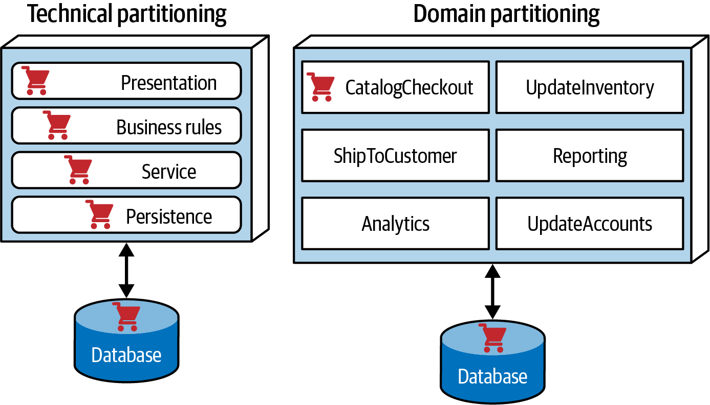

# Architecture Styles

For each domain of the software we should specify the architecture style that best fits the needs of that domain. An architecture style is a specific way to structure and organize the software, including the components, their interactions, and the overall design principles.

## Architecture Partitioning Styles
### Domain Partitioning
Domain-partitioned architectures separate top-level components by workflows and/or domains.
#### Advantages
- Modeled more closely on how the business functions rather than on an implementation detail
- Easier to build cross-functional teams around domains
- Aligns more closely to the modular monolith and microservices architecture styles
- Message flow matches the problem domain
- Easy to migrate data and components to a distributed architecture
#### Disadvantage
- Customization code appears in multiple places

### Technical Partitioning
Technically partitioned architectures separate top-level components based on technical capabilities rather than discrete workflows. This may manifest as layers inspired by Model-View-Controller separation or some other ad hoc technical partitioning. The architecture pictured in Figure 9-6 separates its components based on customization.

#### Advantages
- Clearly separates customization code.
-Aligns more closely to the layered architecture pattern.
#### Disadvantages
- Higher degree of global coupling. Changes to the Common or Local component will likely affect all the other components.
- Developers may have to duplicate domain concepts in both the Common and Local layers.
- Typically, higher coupling at the data level. In a system like this, the application architects and the data architects would likely collaborate to create a single database, including customization and domains. That in turn would create difficulties in untangling the data relationships later, if the architects eventually want to migrate this architecture to a distributed system. Many other factors contribute to choosing an architecture style, as we cover in

### Example

## Monolithic vs Distributed Architectures
### Monolithic Architectures
- Layered architecture pattern
- Pipeline architecture pattern
- Microkernel architecture pattern

### Distributed Architectures
- Service-based architecture pattern
- Event-driven architecture pattern
- Space-based architecture pattern
- Service-oriented architecture pattern
- Microservices architecture pattern
