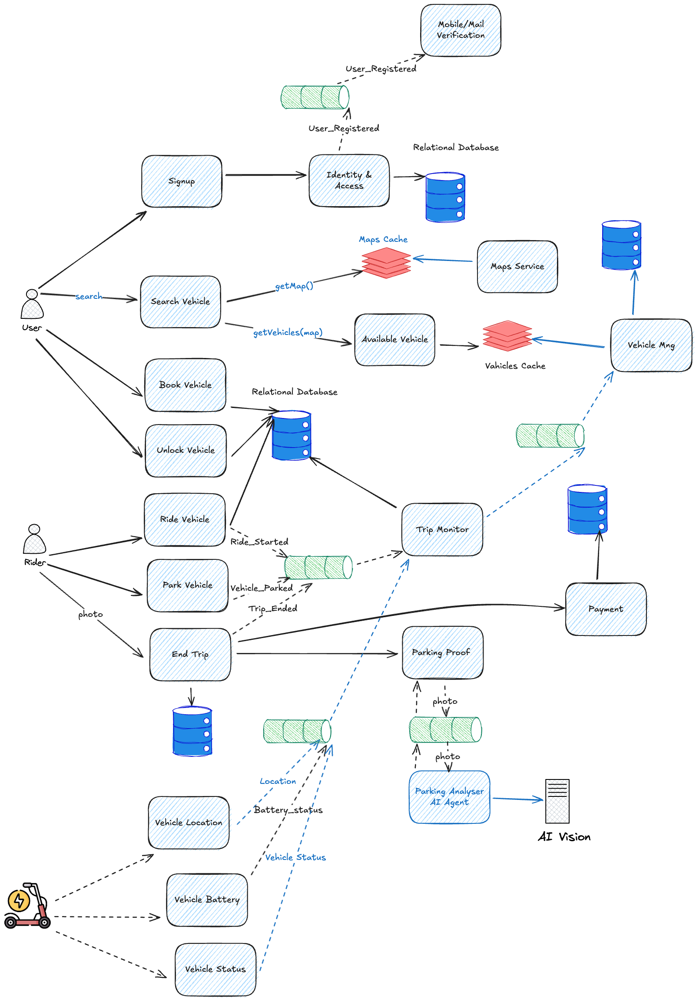

# Component-Based Thinking
In this document we look at the architecture of MobilityCorp's short-term rental services for last-mile transport through the lens of component-based thinking. This approach emphasizes the decomposition of the system into modular, reusable components that can be independently developed, tested, and maintained.

## Trip Journey Components

