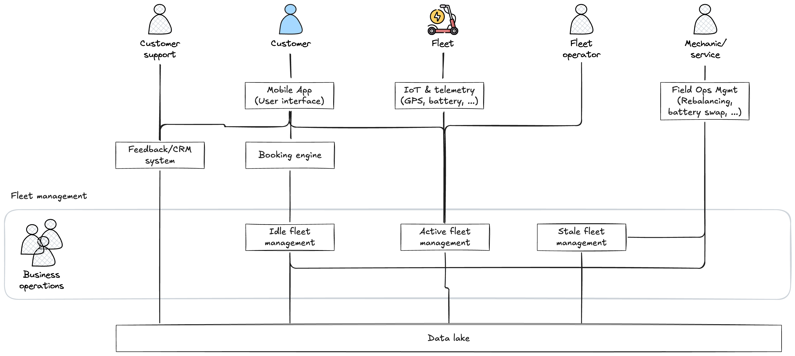

# Architecture overview

## Purpose

This document provides a high-level overview of the architecture for MobilityCorp, a short-term rental service for electric scooters, eBikes, cars, and vans. It outlines the key components, their interactions, and how they support the business requirements and AI-enabled use cases.

## System overview

The architecture is designed to support MobilityCorp's core functionalities, including user management, vehicle tracking, rental processing, payment handling, and AI-driven optimizations. The system leverages cloud services for scalability and reliability, and incorporates AI components to enhance demand forecasting, fleet distribution, battery health monitoring, dynamic pricing, and personalization.

## Component Breakdown

### Mobile app

* Booking interface
* NFC-based unlock/lock
* Vehicle discovery, ride tracking
* Return confirmation via photo upload

### Booking & vehicle management

* Rules-based engine for vehicle type and time constraints
* Coordinates unlock/lock status and GPS tracking
* Fleet monitoring and availability management

### IoT & telemetry

* GPS location
* Battery status
* Lock/unlock telemetry
* Streams into data lake for AI use

### Field operations platform

* Interfaces for technicians
* Task queues for battery swaps and rebalancing
* AI-generated routes and bay priority lists

### Idle fleet management

* Monitors vehicle status when not in use
* Schedules maintenance and charging
* Integrates with AI for battery health predictions

### Active fleet management

* Real-time tracking of rented vehicles
* Usage analytics
* Dynamic pricing adjustments
* AI-driven demand forecasting

### Stale fleet management

* Identifies underutilized vehicles
* Recommends reallocation or promotions
* Integrates with AI for usage prediction

### Data Platform

* Central data lake + stream processor (Kafka, Pulsar)
* Stores historical and real-time ride data, vehicle logs, user events
* Supports AI model training and inference