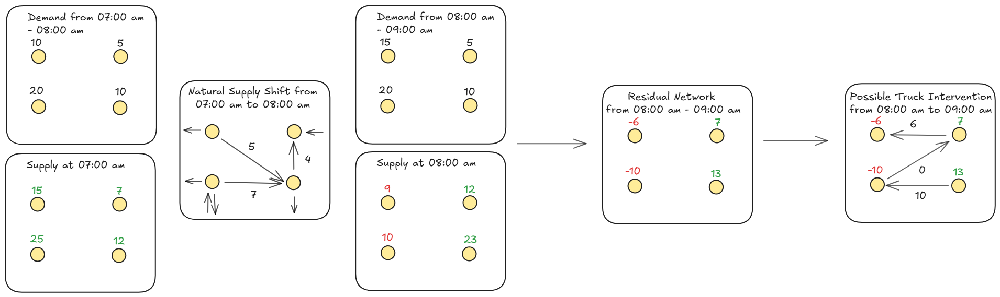
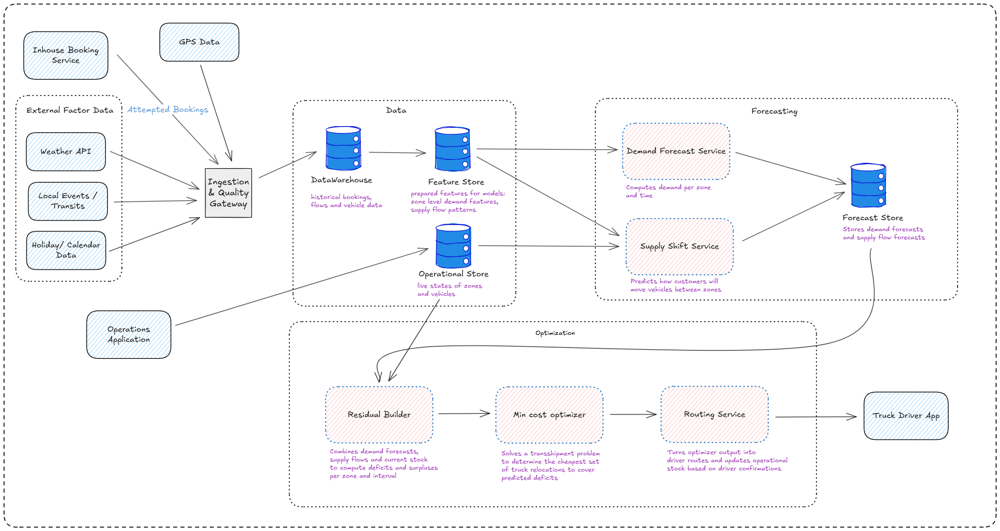

# Scooter and bike rescheduling

This section describes an **ML-driven approach to optimally reroute and reschedule scooters and bikes** so that vehicles are available where and when customers need them. The solution combines **demand forecasting, supply flow prediction, and optimization models** to guide both nightly bulk rebalancing and continuous daytime adjustments.  

By doing so, it directly addresses [Demand & Fleet Positioning](../business/business-challenges.md#1.-demand-&-fleet-positioning), specifically answering all three of its key questions:  
- Can we **anticipate customer demand** at specific times and locations? ✅  
- Can we **reposition vehicles in advance**? ✅  
- Can we **predict demand spikes** (e.g., post-work scooter rides)? ✅  

It also supports the key objective to:  
- **Improve fleet availability and reliability**,  
- **Increase usage of available stock**, and  
- **Strengthen customer loyalty** by ensuring a dependable service for daily commutes and other recurring trips.  

## The Problem

Customers often complain that scooters and bikes are not available where they need them.  
This problem arises because demand is uneven in space and time, while customers naturally relocate vehicles in ways we cannot directly control.  
If we do not anticipate these dynamics, vehicles pile up in some areas while others run dry, leading to lost demand and poor customer satisfaction.

We devide this problem into three steps:

1. We first need to **know the demand** in every zone and every time slice → this is done with the **demand forecast**.  
2. We then need to **simulate how the supply will shift naturally** as customers move scooters and bikes around → this is done with the **supply flow network**.  
3. Finally, we must **see what is left over**, i.e. where deficits and surpluses remain after natural flows, and only there decide where trucks should intervene → this is the **residual network**.  

By separating **prediction** (what will happen naturally) from **optimization** (what we want to change), we can ensure that trucks are only used where they truly add value.

## Business Decision

We made a strategic decision to split rebalancing into **two phases**:

1. **Nightly Relocation (Reset)**  
   - During the night, demand is very low but supply is high.  
   - We use this opportunity to perform a **bulk relocation** so that by **06:00 every zone has its optimal starting stock**.  
   - This starting state must satisfy the **early morning demand forecast** and anticipate the **first natural supply shifts** caused by customers in the hours after 06:00.  
   - In other words: the nightly plan uses both the **demand forecast** and the **supply flow model** to create the most stable possible baseline.  
   - See [ADR-004-nightly-rebalance](../ADRs/ADR-004-nightly-rebalance.md).

2. **Daytime Continuous Optimization**  
   - Once the day begins, bikes and scooters are constantly moving due to customer trips.  
   - We predict these **natural relocations** via the supply flow forecast and only use trucks where demand will not be satisfied otherwise.  
   - This ensures that trucks are used sparingly and effectively, reducing costs while keeping customers happy.  
   - Here we add the **residual network** to identify surpluses and deficits and compute specific **intraday truck routes** (via min-cost transshipment) so that we can actively rebalance the system during the day.  

## Machine Learning Models

To enable this strategy, we rely on **two predictive models** that describe how customers interact with the fleet, plus an **optimization model** that decides how trucks should intervene.

### 1. Demand Forecast Model

The **demand forecast** tells us *what customers want* — the attempted bookings per zone in each time interval, regardless of whether we have supply available.

* **Inputs**:
  * Historical attempted bookings from the in-house booking system.
  * External data such as weather forecasts, holidays, and events.
* **Method**: ARIMAX baseline (time-series with exogenous factors).
* **Granularity**: Predicts demand per zone in **15-minute intervals**.
* **Output**: A **time series of demand forecasts** for each zone (e.g., “Zone A: 10 bookings expected between 08:00–08:15”).

This forecast provides the baseline demand curve we must satisfy in both the **nightly reset** and the **daytime optimization**.

See [ADR-010-demand-forecast-model](../ADRs/ADR-010-demand-forecast-model.md).

### 2. Supply-Shift Model

The **supply-shift model** tells us *how customers move vehicles* between zones, conditional on current availability.
For example: if Zone A has 20 scooters at 08:00, and history shows 30% usually flow to Zone B in that slot, we expect around 6 scooters to move. If Zone A has only 2 scooters, then only 2 can move, even if demand would be higher.

* **Inputs**:

  * **Current zone stock** (GPS data).
  * **Historical relocation patterns** (pickup/dropoff pairs).
* **Output**: Predicted **user-driven relocations** between zones and times, forming **natural flow arcs** in the supply flow network.

This model is essential because it prevents us from overestimating deficits or surpluses: it tells us which zones will naturally self-balance thanks to customers.

### 3. Residual Network Optimizer

The **residual optimizer** is where we bring together the **demand forecast** and the **supply-shift model** to see the *real imbalances* that customers will experience if nothing is done. 

Think of it step by step:
1. **Demand forecast** tells us:  
   - For each zone and each 15-minute interval, how many attempted bookings we expect.  
   - Example: Zone A at 09:30–09:45 → predicted demand = 20 rides.  
2. **Current stock** tells us how many vehicles are available right now at each zone.  
   - Example: Zone A currently (08:30) has 10 scooters
3. **Supply-shift model** projects how this stock will redistribute in future intervals based on customer flows.  
   - Example: Of the 10 scooters in Zone A now, we expect 5 to be taken to other zones by 09:30.  
   - At the same time, we expect 8 scooters to flow into Zone A from other zones by 09:30.  
4. **Residual calculation**:  
   - Predicted available supply at Zone A for 09:30–09:45 =  
     current stock (10) – outflow (5) + inflow (8) = 13.  
   - Predicted demand = 20.  
   - **Residual deficit = 7**.  

This process runs continuously for all zones and all 15-minute intervals in the forecast horizon.  
The result is a **residual network** where each node (zone, time) is labeled as:  
- **Surplus**: predicted supply > predicted demand.  
- **Deficit**: predicted supply < predicted demand.  

Therefore the residual network shows us **only the gaps that matter** after accounting for customer behavior.  
- If demand and supply naturally balance (thanks to customer relocations), trucks do nothing.  
- If a deficit remains (like Zone A with -7 in the example), the residual network highlights it as a **target for rebalancing**.  

### Optimization

Once surpluses and deficits are identified:  
- We connect surplus nodes to deficit nodes with possible truck moves (edges).  
- We then solve an optimization problem via **Min-cost transshipment** → find the cheapest way to cover deficits with surpluses
  See [ADR-012-min-cost-transshipment-solver](../ADRs/ADR-012-min-cost-transshipment-solver.md).

**Output**: concrete truck relocation plans such as:  
- “Truck 1 picks up 10 scooters at Zone B at 08:45, drops 7 at Zone A by 09:15, swaps 5 batteries on the way.”  

This ensures trucks are only dispatched to fix **residual gaps** that natural flows cannot cover.

### Visualization
The following images visualizes the prediction and optimization process:

## Architecture
The following C2 diagram shows a possible architecture:

## Execution Loop

The system runs in a **rolling horizon** throughout the day:

- Every 10–15 minutes, we refresh forecasts, rebuild the supply flow network, compute residuals, and re-run optimization.  
- Trucks are dispatched with only the **next leg committed**, but drivers see a possible multistop tour in advance
- When a truck confirms a move:  
  - The source stock is reduced immediately.  
  - An “unnatural arc” is added to the supply flow network.  
  - Forecasts and residuals are recomputed, so the system always stays aligned with reality.  

## Costs of the Approach

Our chosen approach — combining a **demand forecast**, a **supply-shift forecast**, and a **residual optimization via min-cost transshipment** — is deliberately lightweight in terms of cost:

- **Computational cost**:  
  - Demand forecasting with ARIMAX and supply-shift predictions are simple, interpretable models that can run efficiently at scale.  
  - Min-cost transshipment is a polynomial-time optimization problem and can be solved quickly even for large networks, making it suitable for frequent re-runs.  

### Why this is a good choice

- **Low infrastructure footprint**: no heavy deep learning pipelines are required at this stage.  
- **Fast to run and update**: models and optimization can be refreshed every 10–15 minutes.  
- **Explainable**: each decision (demand forecast → supply forecast → residual gap → truck move) is transparent and traceable.  
 

## Conclusion

With this setup we directly address the root cause of the problem: scooters and bikes being in the wrong places.  

- The **demand forecast** ensures we know where customers will want vehicles, in 15-minute resolution.  
- The **supply-shift model** shows how customers will naturally redistribute vehicles, so we don’t waste truck effort fixing what will fix itself.  
- The **residual optimizer** isolates only the true gaps and turns them into actionable truck routes, ensuring that deficits are covered in time.  
- The **rolling execution loop** keeps predictions and actions aligned with reality, as every confirmed truck move feeds back into the system.  

As a result:  
- Customers find vehicles when and where they need them.  
- The company reduces lost demand while minimizing costly truck relocations.  

For further details and rationale behind each decision, see the linked ADRs.  